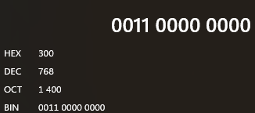
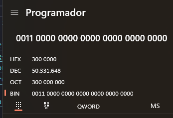
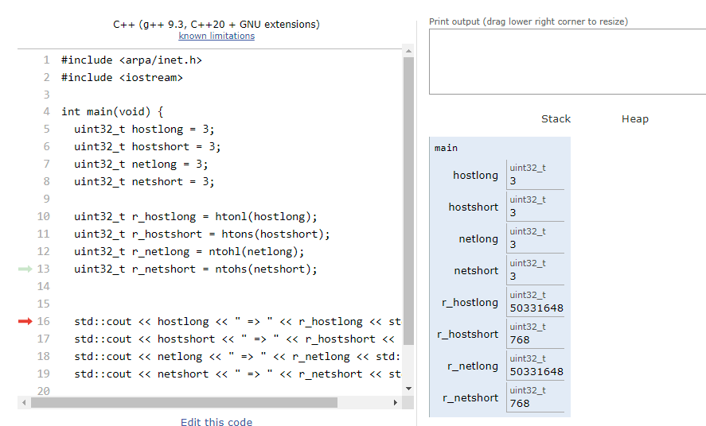
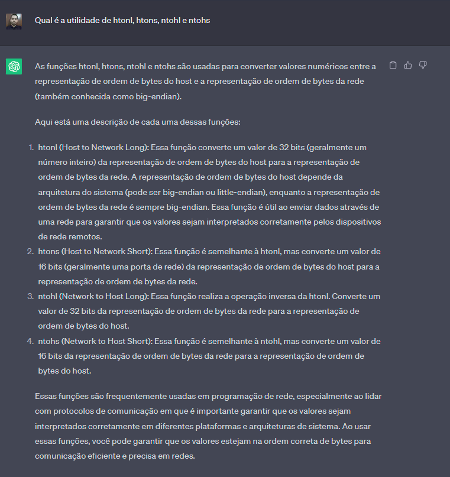

# Estudos

## funções

### execve ([Referencia](https://man7.org/linux/man-pages/man2/execve.2.html))

```c
#include <unistd.h>

int execve(const char *pathname, char *const _Nullable argv[], char *const _Nullable envp[]);
```

O execve executa programas que são passados pelo parâmetro _pathname_.

O argv deve ter ao menos o _pathname_ dentro dele algo como: _[pathname, NULL]_

O envp pode ser NULL, para execuções simples.

- Caso a execução ocorra com sucesso ele irá retornar o **PID da aplicação**
- Caso a execução falhe ele irá retornar **-1**
  - Caso a execução falhe podemos buscar o porque com as funções **strerror, gai_strerror, errno**

### dup | dup 2 ([Referencia](https://man7.org/linux/man-pages/man2/dup2.2.html))

```c
#include <unistd.h>

int dup(int oldfd);
int dup2(int oldfd, int newfd);
```

O dup aloca um novo File descriptor (FD). Ele basicamente copia o FD que é passado como parâmetro em _oldfd_, com isso em mente é possível fechar o _oldfd_ que o FD novo ainda continuara aberto.

O dup2 faz a mesma que dup

- Caso a execução ocorra com sucesso ele irá retornar o novo **FD**
- Caso a execução falhe ele irá retornar **-1**
  - Caso a execução falhe podemos buscar o porque com as funções **strerror, gai_strerror, errno**

### pipe ([Referencia](https://man7.org/linux/man-pages/man2/pipe.2.html))

```c
#include <unistd.h>

int pipe(int pipefd[2]);
```

O pipe cria dois File descriptor (FD), um para somente leitura e outro para somente escrita, sendo:

- [0]: somente leitura
- [1]: somente escrita **(deve ser fechado primeiro)**
- Caso a execução ocorra com sucesso ele irá retornar **0**
- Caso a execução falhe ele irá retornar **-1**
  - Caso a execução falhe podemos buscar o porque com as funções **strerror, gai_strerror, errno**

### strerror ([Referencia](https://man7.org/linux/man-pages/man3/strerror.3.html))

```c
#include <string.h>

char *strerror(int errnum);
```

O strerror recebe um código de erro que pode ser obtido com a variável **errno** e retorna uma string apropriada para o código passado. Caso o codigo não seja reconhecido ele irá retornar **"Unknown error nnn"**

### gai_strerror ([Referencia](https://man7.org/linux/man-pages/man3/gai_strerror.3p.html))

```c
#include <netdb.h>

const char *gai_strerror(int ecode);
```

O gai_strerror recebe um código de erro que é possível obter com a função **getaddrinfo**. Ao que parece ele vai servir para pegar erros específicos de socket:
|              |              |
| ------------ | ------------ |
| EAI_AGAIN    | EAI_NONAME   |
| EAI_BADFLAGS | EAI_OVERFLOW |
| EAI_FAIL     | EAI_SERVICE  |
| EAI_FAMILY   | EAI_SOCKTYPE |
| EAI_MEMORY   | EAI_SYSTEM   |

### errno  ([Referencia](https://man7.org/linux/man-pages/man3/gai_strerror.3p.html))

```c
#include <errno.h>
```

O errno é uma variável que guarda o código do ultimo erro

O uso deve ser
```c
int tst = errno;
```

### fork  ([Referencia](https://man7.org/linux/man-pages/man2/fork.2.html))

```c
#include <unistd.h>

pid_t fork(void);
```

O fork cria um novo processo filho.
- Caso a execução ocorra com sucesso ele irá retornar **0**
- Caso a execução falhe ele irá retornar **-1**
  - Caso a execução falhe podemos buscar o porque com as funções **strerror, gai_strerror, errno**

O uso deve ser
```c
// Vem executando normalmente

if (fork() == 0) {
  // Executa o código do filho
  std::cout << "A" << std::endl;
}

// Executa o código do pai
std::cout << "B" << std::endl;
```
    Saida:
    A
    B

Caso não use o if o comportamento será assim:
```c
fork();
fork();
fork();
std::cout << "Executou" << std::endl;
```
    Saida:
    Executou
    Executou
    Executou
    Executou
    Executou
    Executou
    Executou
    Executou

### htons | htonl | ntohs | ntohl  ([Referencia](https://linux.die.net/man/3/htons))

```c
#include <arpa/inet.h>

uint32_t htonl(uint32_t hostlong);
uint16_t htons(uint16_t hostshort);
uint32_t ntohl(uint32_t netlong);
uint16_t ntohs(uint16_t netshort);
```

Essas funções são conversores. Ao que parece eles funcionam para converter coisas especificas em coisas ainda mais especificas.

O htonl converte o hostlong de 'host byte order' para 'network byte order'. O inverso do ntohl. Serve para 32 bits.

O htons converte o hostshort de 'host byte order' para 'network byte order'. O inverso do ntohs. Serve para 16 bits

O ntohl converte o netlong de 'host byte order' para 'network byte order'. O inverso do ntohl. Serve para 32 bits.

O ntohs converte o netshort de 'host byte order' para 'network byte order'. O inverso do htons. Serve para 16 bits.

A realidade é que essas funções invertem a ordem de bytes.

- De
  - 
- Para 16 bits
  - 
- Para 32 bits
  - 
- Exemplo
  - 

Peguei algumas referencias na internet:

[Referencia 1](https://wiki.sei.cmu.edu/confluence/display/c/POS39-C.+Use+the+correct+byte+ordering+when+transferring+data+between+systems#:~:text=The%20functions%20htonl()%20%2C%20htons,and%20the%20host's%20byte%20ordering.)

[Referencia 2](https://www.gta.ufrj.br/ensino/eel878/sockets/htonsman.html)

Perguntei pro chatgpt
- 

A ideia de uso é mais ou menos essa:

Cliente
```c
#include <stdio.h>
#include <stdlib.h>
#include <arpa/inet.h>

typedef struct {
    int id_cliente;
    float saldo;
} DadosCliente;

int main() {
    DadosCliente cliente;
    cliente.id_cliente = 123;
    cliente.saldo = 1000.50;

    // Converter os campos da estrutura para a representação de ordem de bytes da rede
    int id_convertido = htonl(cliente.id_cliente);
    float saldo_convertido = htonl(cliente.saldo);

    // Simulação do envio dos dados pela rede
    // Aqui, você enviaria 'id_convertido' e 'saldo_convertido' pela rede

    return 0;
}
```

Servidor
```c
#include <stdio.h>
#include <stdlib.h>
#include <arpa/inet.h>

typedef struct {
    int id_cliente;
    float saldo;
} DadosCliente;

int main() {
    // Simulação do recebimento dos dados pela rede
    int id_recebido;
    float saldo_recebido;

    // Aqui, você receberia 'id_recebido' e 'saldo_recebido' da rede

    // Converter os campos recebidos de volta para a representação de ordem de bytes do host
    int id_cliente = ntohl(id_recebido);
    float saldo = ntohl(saldo_recebido);

    // Utilizar os dados recebidos
    DadosCliente cliente;
    cliente.id_cliente = id_cliente;
    cliente.saldo = saldo;

    printf("ID do cliente: %d\n", cliente.id_cliente);
    printf("Saldo: %.2f\n", cliente.saldo);

    return 0;
}
```

### select ([Referencia](https://man7.org/linux/man-pages/man2/select.2.html))

```c
 #include <sys/select.h>

int select(int nfds, fd_set *_Nullable restrict readfds, fd_set *_Nullable restrict writefds, fd_set *_Nullable restrict exceptfds, struct timeval *_Nullable restrict timeout);
```

    Aviso: O select pode monitorar apenas FD menores que FD_SETSIZE (1024) e essa limitação não pode e não será alterada. Aplicações modernas devem usar o poll(2) ou epoll(7)

Pelo que a documentação falou o ideal é usar o poll ou epoll que são funções permitidas, mesmo assim vamos ver o que o select pode fazer.

O select permite que um programa monitore vários (1024) FD, esperando que o FD fique "pronto" para alguma operação de I/O

Então o select é uma das funções que iremos usar para monitorar os FD's

### poll ([Referencia](https://man7.org/linux/man-pages/man2/poll.2.html))

```c
#include <poll.h>

int poll(struct pollfd *fds, nfds_t nfds, int timeout);
```

Ele é similar ao select, monitora os FD's ate que algum esteja pronto para uma operação de I/O. Usando a seguinte estrutura:

```c
struct pollfd {
     int   fd;         /* file descriptor */
     short events;     /* requested events */
     short revents;    /* returned events */
};
```
O FD passado deve ser o FD aberto pela função socket

### epoll ([Referencia](https://man7.org/linux/man-pages/man7/epoll.7.html))

```c
#include <sys/epoll.h>
```

Ele é similar ao poll, porem é especifico para unix, além de dar mais funcionalidades.

#### epoll_create ([Referencia](https://man7.org/linux/man-pages/man2/epoll_create.2.html))

```c
#include <sys/epoll.h>

int epoll_create(int size);
```

Cria uma nova instancia de epoll. retornando um FD referenciando a nova instancia de epoll.

#### epoll_ctl ([Referencia](https://man7.org/linux/man-pages/man2/epoll_ctl.2.html))

```c
#include <sys/epoll.h>

int epoll_ctl(int epfd, int op, int fd, struct epoll_event *_Nullable event);
```

# A fazer!

#### epoll_wait ([Referencia](https://man7.org/linux/man-pages/man2/epoll_wait.2.html))

```c
#include <sys/epoll.h>

int epoll_wait(int epfd, struct epoll_event *events, int maxevents, int timeout);
```

# A fazer!

### kqueue | kevent ([Referencia](https://man.freebsd.org/cgi/man.cgi?query=kqueue&sektion=2))

```c
#include <sys/event.h>

int kqueue(void);

int kevent(int kq, const struct kevent *changelist, int nchanges, struct kevent *eventlist, int nevents, const struct timespec timeout);
```

# A fazer!
